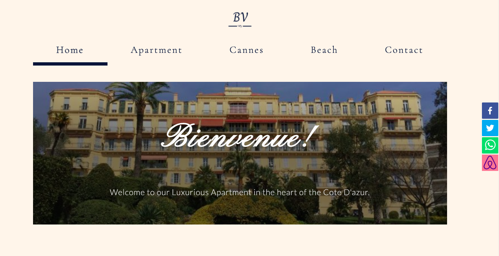
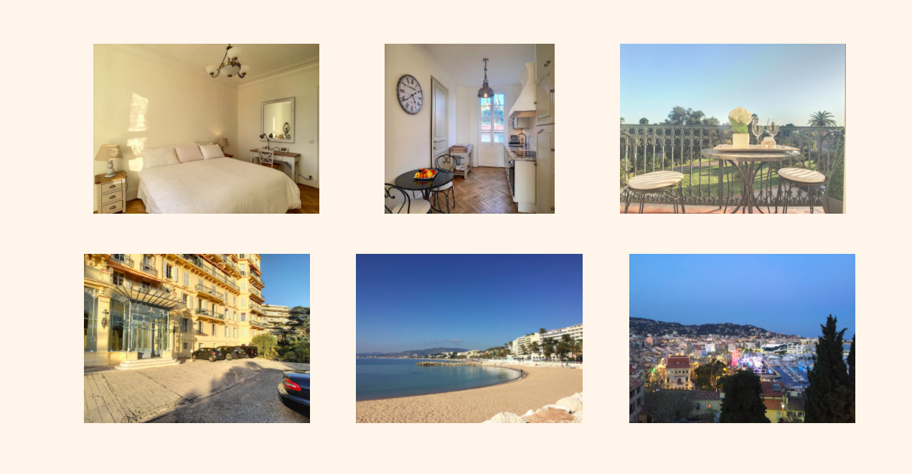
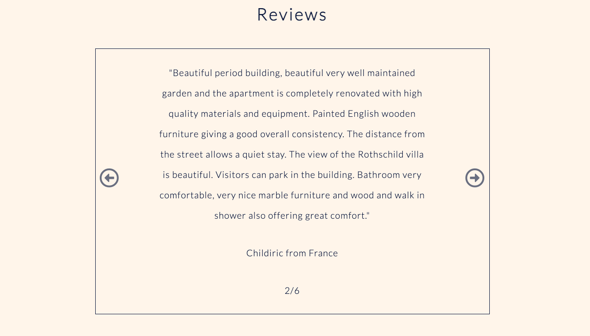
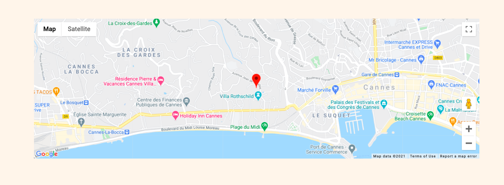
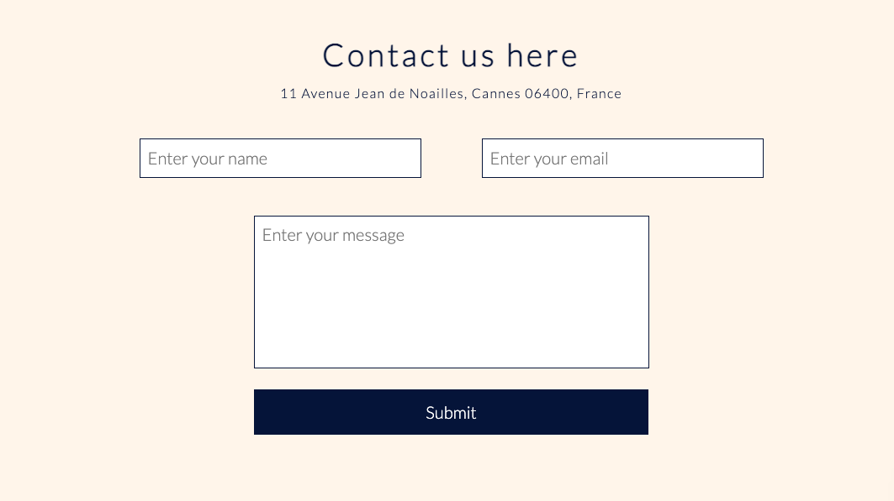

# Cannes Website

### Website for Rental Apartment in Cannes

This is a website I created using React for a rental apartment in Cannes, France.

I created multiple resusable containers and used props to pass information between each of the components.

Some of the packages I used were react-router-dom, react-helmet, lodash, react-share, emailjs-com, prop-types, react-scripts and web-vitals.

